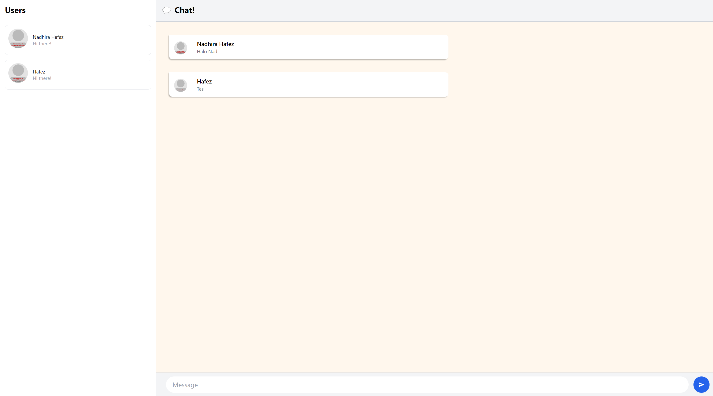

# Tutorial 10

**3.1. Original code**
  

**3.2. Add some creativities to the webclient**  
Saya membuat perubahan pada lebar kolom, border, dan warna background `User`, mengubah tulisan `Chat` dan `Users` menjadi bold, mengubah warna pada chat dan menambah shadow pada bubble chat
